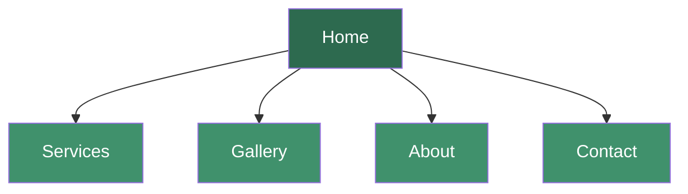
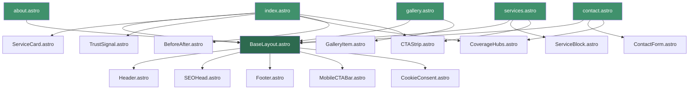

# Walsh Garden & Treecare — Website Specification Document

## 1. Project Overview

| Field | Detail |
|---|---|
| **Client** | John Walsh |
| **Business Name** | Walsh Garden & Treecare |
| **Industry** | Gardening, Tree Surgery & Landscaping |
| **Coverage** | Nationwide across all counties in Ireland |
| **Primary Contact** | 089 449 4281 (Direct Calls & WhatsApp) |
| **Facebook** | Walsh Garden and Treecare (link to be confirmed with client) |
| **Site Type** | Static site built with **Astro** (SSG) — zero client JS by default, component-based, built-in image optimisation |
| **Total Pages** | 5 |
| **Primary CTA** | "Get a Free Quote on WhatsApp" → opens WhatsApp chat to 089 449 4281 |
| **Secondary CTA** | "Call Now" → `tel:+353894494281` |
| **Hosting** | **Cloudflare Pages** (recommended) or **Vercel** — free tier, auto SSL, global CDN, Git-push deploys |
| **Hosting Plan** | €50/month tradie package (hosting, SSL, maintenance included) — hosting cost to WebEngineer is \$0 on free tier |
| **Domain** | TBC — suggest `walshgardenandtreecare.ie` or similar `.ie` (register via Cloudflare Registrar or external registrar) |

> [!IMPORTANT]
> **Geographical Messaging**: All copy must emphasise **"Nationwide Coverage across Ireland"**. Do **NOT** mention Athlone or any specific base town anywhere on the site. The client was explicit about this.

---

## 2. Site Architecture — 5 Pages



| # | Page | URL Slug | Purpose |
|---|---|---|---|
| 1 | **Home** | `/` (index.html) | Hero, service overview cards, trust signals, primary CTA |
| 2 | **Services** | `/services.html` | Detailed breakdown of all 5 confirmed service categories |
| 3 | **Gallery** | `/gallery.html` | Before/after image showcase (~33 images) |
| 4 | **About** | `/about.html` | John's story, experience, values, nationwide reach |
| 5 | **Contact** | `/contact.html` | WhatsApp CTA, phone, service area map, simple form |

---

## 3. Design Specifications

### 3.1 Brand & Visual Identity

| Element | Specification |
|---|---|
| **Primary Colour** | Forest Green `#2d6a4f` — trust, nature, professionalism |
| **Secondary Colour** | Warm Amber/Gold `#d4a017` — energy, CTA highlights |
| **Accent / Dark** | Charcoal `#1b1b1b` — text, footer |
| **Background** | Off-white `#f8f9fa` with white `#ffffff` card sections |
| **CTA Buttons** | WhatsApp Green `#25D366` for WhatsApp buttons; Amber for secondary |
| **Typography — Headings** | Google Font: **Montserrat** (Bold 700) — modern, strong, tradesman feel |
| **Typography — Body** | Google Font: **Open Sans** (Regular 400 / Semi-Bold 600) — clean readability |
| **Border Radius** | 8px on cards, 50px (pill) on CTA buttons |
| **Shadows** | Subtle `box-shadow: 0 2px 8px rgba(0,0,0,0.08)` on cards |
| **Icon Set** | Font Awesome 6 Free (tree, leaf, phone, WhatsApp, map-marker, star icons) |

### 3.2 Responsive Breakpoints

| Breakpoint | Target |
|---|---|
| `≥1200px` | Desktop (max-width container: 1140px) |
| `992–1199px` | Small desktop / landscape tablet |
| `768–991px` | Tablet portrait |
| `≤767px` | Mobile (primary — most traffic will be mobile) |

> [!TIP]
> **Mobile-first build** is mandatory. The target audience (homeowners searching "tree surgeon near me") will overwhelmingly arrive via mobile. The WhatsApp and Call buttons must be thumb-reachable at all times.

### 3.3 Global UI Components

#### Sticky Header / Navigation
- Logo (left): Business name text logo "Walsh Garden & Treecare" with a small tree/leaf icon
- Nav links (right): Home | Services | Gallery | About | Contact
- On mobile: hamburger menu (animated slide-in from right)
- **Sticky CTA strip on mobile**: A slim fixed bar at the bottom of the viewport with two buttons side-by-side:
  - 📞 **Call Now** (green, `tel:` link)
  - 💬 **WhatsApp Quote** (WhatsApp green, `wa.me` link)

#### Footer
- Business name & one-liner tagline
- Quick links to all 5 pages
- Contact details: phone number, WhatsApp link
- Facebook icon linking to their page
- Small text: "Serving all counties across Ireland"
- Copyright line: `© 2026 Walsh Garden & Treecare. All rights reserved.`
- Privacy Policy link (can be a simple modal or anchor section — GDPR baseline)

---

## 4. Page-by-Page Content & Layout Specification

---

### 4.1 PAGE 1: Home (`index.html`)

The homepage is the most critical page. It must answer three questions within 3 seconds: **What do you do? Where do you do it? How do I contact you?**

#### Section A — Hero Banner
| Element | Detail |
|---|---|
| **Layout** | Full-width background image (one of John's best "after" shots — lush garden or clean tree job) with dark overlay (rgba 0,0,0,0.5) |
| **Headline (H1)** | `Professional Garden & Tree Services — Nationwide Across Ireland` |
| **Subheadline** | `Expert tree surgery, garden clearances, hedge trimming & lawn care. Fully mobile and serving all counties.` |
| **CTA Buttons** | Two buttons side-by-side (stacked on mobile): |
| | 1. 💬 **"Get a Free Quote on WhatsApp"** → `https://wa.me/353894494281?text=Hi%20John%2C%20I%20found%20your%20website%20and%20I%27d%20like%20a%20free%20quote%20for...` |
| | 2. 📞 **"Call 089 449 4281"** → `tel:+353894494281` |
| **Height** | 85vh on desktop, 70vh on mobile |

#### Section B — Service Overview Cards (5 cards)
- **Layout**: 3-column grid on desktop (top row 3, bottom row 2 centred), 2-column on tablet, 1-column stacked on mobile
- Each card contains:
  - Font Awesome icon (relevant to service)
  - Service name (H3)
  - 2-sentence summary
  - "Learn More →" link to the Services page (anchored to that service section)

**The 5 Service Cards (all confirmed by client):**

1. **🌳 Tree Surgery & Care**
   - Professional tree felling, crown reduction, precision branch pruning, limb removal, and safe dismantling of dangerous or storm-damaged trees.

2. **🌿 Hedge Trimming & Maintenance**
   - Regular hedge cutting, heavy reductions, reshaping, and complete boundary hedge maintenance for properties of all sizes.

3. **🏡 Garden Clearances & Makeovers**
   - Full removal of overgrown briars, ivy, and weeds, clearing wild sites, and preparing ground for fresh use.

4. **🌱 Lawn Care & Maintenance**
   - Large-scale grass cutting, turf maintenance, lawn restoration, and edge trimming.

5. **🪵 Stump Grinding & Removal**
   - Machine grinding of old tree stumps down below ground level to leave lawns clean and ready for reuse.

#### Section C — Why Choose Us? (Trust Signals)
- **Layout**: 4-column icon grid (2×2 on mobile)
- Items:
  1. 🇮🇪 **Nationwide Coverage** — "Serving all provinces and counties across Ireland weekly"
  2. 💬 **Free Quotes** — "Fast, no-obligation quotes via WhatsApp or phone"
  3. 🚛 **Dedicated Transport Fleet** — "Fully equipped vehicles for reliable, on-time service anywhere"
  4. ⭐ **Experienced & Reliable** — "Professional gardener & tree surgeon you can count on"

#### Section C2 — Coverage Hubs (NEW — from client's confirmed data)
- **Layout**: 4-column coloured cards (stacked 2×2 on tablet, 1-column on mobile). Each card has a coloured left border matching the hub colour below.
- **Heading**: "Servicing All Four Provinces — Weekly Routes Nationwide"

| Card Colour | Hub | Counties |
|---|---|---|
| 🟢 Green | **The Midlands** | Offaly · Westmeath · Laois · Longford |
| 🔵 Blue | **Leinster** | Greater Dublin Area · Kildare · Meath · Louth · Wexford |
| 🟡 Gold | **Munster** | Cork City & County · Limerick · Waterford · Kerry |
| 🔴 Red | **Connacht & Ulster** | Roscommon · Galway · Mayo · Sligo · Donegal |

- Small text below cards: "✨ Equipped with a dedicated transport fleet for reliable, on-time service to every county."
- **Note**: Do NOT mention "Athlone" as a hub name — list only county names. The Midlands hub omits "Athlone" and lists "Offaly · Westmeath · Laois · Longford" only.

#### Section D — Before & After Showcase (Mini Gallery)
- **Layout**: 3 side-by-side before/after image pairs (best 3 from his 33 images)
- Each pair uses a CSS slider (drag handle to reveal before vs after) or simple side-by-side with "BEFORE" / "AFTER" labels
- **CTA below**: "See More of Our Work →" button linking to Gallery page

#### Section E — Testimonials *(if available)*
- Placeholder section for 2–3 client testimonials
- If John doesn't have written testimonials yet, use a prompt like: *"Ask John to collect 2-3 short reviews from past clients, or pull reviews from his Facebook page if any exist"*
- Card layout: quote text, client first name, general location (e.g., "— Mary, Co. Galway")

#### Section F — Quick Contact Strip
- Dark green background bar
- Headline: "Ready to transform your outdoor space?"
- Two CTA buttons (same as hero)
- Small text: "We respond to all enquiries within 2 hours"

---

### 4.2 PAGE 2: Services (`services.html`)

#### Section A — Page Hero
- Shorter hero (40vh) with background image, heading: **"Our Services"**
- Subheading: *"From single tree removals to full estate transformations — we cover it all, Nationwide."*

#### Section B — Service Detail Blocks
Each service gets its own full-width alternating section (left image / right text, then swap). Each block contains:

| Element | Detail |
|---|---|
| **Image** | One of John's relevant before/after photos |
| **Service Name (H2)** | Anchored ID for deep linking (e.g., `id="tree-surgery"`) |
| **Description** | 3–4 sentences of SEO-rich, client-friendly copy |
| **Bullet List** | 4–6 specific tasks within that service |
| **CTA** | "Get a Free Quote for [Service Name]" → WhatsApp link with pre-filled message specific to that service |

**Service blocks to build (5 total — all confirmed by client):**

##### Block 1: Tree Surgery & Care (`#tree-surgery`)
- Tree felling (all sizes, confined spaces)
- Crown reduction & crown thinning
- Precision branch pruning
- Dangerous / storm-damaged tree dismantling
- Limb removal over structures
- Sectional felling near buildings & power lines

##### Block 2: Hedge Trimming & Maintenance (`#hedge-trimming`)
- Regular hedge cutting schedules
- Heavy hedge reduction
- Hedge reshaping & topiary
- Boundary hedge maintenance
- Removal of overgrown hedgerows
- New hedge planting advice

##### Block 3: Garden Clearances & Makeovers (`#garden-clearances`)
- Full site clearance (briars, ivy, weeds)
- Overgrown garden rescue
- Wild/derelict site clearing
- Green waste removal
- Ground preparation for landscaping
- Complete garden makeover planning

##### Block 4: Lawn Care & Maintenance (`#lawn-care`)
- Large-scale grass cutting
- Turf maintenance & repair
- Lawn restoration
- Edge trimming
- Seasonal lawn care programmes
- Ride-on mower service for large areas

##### Block 5: Stump Grinding & Removal (`#stump-grinding`)
- Machine grinding of old tree stumps below ground level
- Leaving lawns clean and ready for reuse
- Root removal
- Site levelling after removal
- Replanting preparation

#### Section C — Bottom CTA Strip
- Same design as homepage Section F

---

### 4.3 PAGE 3: Gallery (`gallery.html`)

#### Section A — Page Hero
- Short hero (35vh): **"Our Work"**
- Subheading: *"Real results from real jobs across Ireland. See the difference professional care makes."*

#### Section B — Filter Tabs *(optional, can be static categories)*
- Simple filter buttons: **All | Trees | Hedges | Gardens | Lawns | Commercial**
- If JS filtering is too complex for scope, use simple category headings instead

#### Section C — Before & After Grid
- **Layout**: Masonry-style or uniform grid (3 columns desktop, 2 tablet, 1 mobile)
- Each gallery item:
  - Before image (left or top)
  - After image (right or bottom)
  - Caption label: service type + brief note (e.g., "Tree Felling — Dangerous ash removal")
  - Lightbox on click: full-size image viewer with left/right navigation
- **Image count**: ~33 images (approx 16 before/after pairs + some standalone shots)
- Use lazy loading (`loading="lazy"`) for performance

> [!IMPORTANT]
> **Image Handling (Astro simplifies this significantly)**: John's 33 raw images go into `src/assets/gallery/`. Astro's built-in `<Image>` and `<Picture>` components handle the rest automatically at build time:
> 1. **Format conversion**: Auto WebP/AVIF with JPG fallback
> 2. **Responsive `srcset`**: Multiple sizes generated automatically
> 3. **Lazy loading + width/height**: Injected by default (prevents CLS)
> 4. **Alt text** must still be written manually for every image (SEO + accessibility): descriptive, include service keyword
> 5. **File naming convention**: `tree-felling-before-01.jpg`, `hedge-trimming-after-03.jpg` etc. (source files — Astro outputs optimised versions)

#### Section D — CTA
- "Like what you see? Get your free quote today" → WhatsApp + Call buttons

---

### 4.4 PAGE 4: About (`about.html`)

#### Section A — Page Hero
- Short hero: **"About Walsh Garden & Treecare"**

#### Section B — John's Story
- **Layout**: Two-column — photo of John at work (left), text (right). Stacks on mobile.
- **Content direction** (copywriter to flesh out):
  - John is a professional gardener and tree surgeon
  - Passionate about transforming outdoor spaces
  - Serves clients across **all counties in Ireland** — fully mobile operation
  - Experienced in both residential properties and large commercial estates
  - Committed to safe, professional, and tidy work
  - Personally attends every job — you deal directly with the person doing the work
  - Available for free, no-obligation quotes via WhatsApp or phone

> [!NOTE]
> The copy should be written in a warm, personal, first-person or close-third-person voice. Avoid corporate jargon. John is a tradesman — the tone should be approachable, trustworthy, and down-to-earth.

#### Section C — Why Work With Us? (Value Props)
- Icon grid (similar to homepage trust signals but expanded):
  1. **Fully Mobile Service** — We come to you, anywhere in Ireland
  2. **Deal Directly With John** — No middlemen, no call centres
  3. **Free Quotes** — No-obligation pricing via WhatsApp or phone
  4. **Dedicated Transport Fleet** — Equipped vehicles for reliable, on-time service nationwide
  5. **Clean & Tidy** — All waste removed, site left spotless
  6. **Nationwide Weekly Routes** — Servicing Midlands, Leinster, Munster, Connacht & Ulster every week

#### Section D — Facebook CTA
- "Follow us on Facebook for our latest work" with link to Walsh Garden and Treecare Facebook page
- Optionally embed a Facebook feed widget (but keep it lightweight — a simple link/button is often better for performance)

---

### 4.5 PAGE 5: Contact (`contact.html`)

#### Section A — Page Hero
- Short hero: **"Get In Touch"**
- Subheading: *"Request a free quote or ask us anything — we respond within 2 hours."*

#### Section B — Contact Methods (3-column cards)

| Card | Detail |
|---|---|
| 💬 **WhatsApp** | "Tap to send us a message" → `wa.me` link with pre-filled text. Large green WhatsApp button. |
| 📞 **Call** | "Tap to call John directly" → `tel:+353894494281`. Display number: 089 449 4281 |
| 📘 **Facebook** | "Message us on Facebook" → Link to Facebook page |

#### Section C — Simple Contact Form *(optional — static site consideration)*
- Fields: Name, Phone Number, Email (optional), Service Needed (dropdown), Brief Description (textarea)
- **Implementation options for static site**:
  - [Formspree](https://formspree.io) (free tier: 50 submissions/month)
  - [Netlify Forms](https://www.netlify.com/products/forms/) if hosted on Netlify
  - [EmailJS](https://www.emailjs.com/) for client-side email sending
  - Google Forms embed (simplest but least branded)
- **Recommended**: Formspree — zero backend, submissions forwarded to John's email
- On submit: show success message "Thanks! John will get back to you within 2 hours."

> [!TIP]
> Even with a contact form, the **WhatsApp CTA should be visually dominant**. John wants direct WhatsApp contact — the form is a fallback for users who prefer it.

#### Section D — Service Area & Coverage Hubs
- **Heading**: "Proudly Serving All Four Provinces — Weekly Routes Nationwide"
- **Map**: Embedded **Google Map** centred on Ireland (zoomed to show the whole country, **no specific pin on Athlone**). Use a general centre point or no marker at all — the point is to show nationwide coverage.
- **Below the map**: 4-column coverage hub cards matching the homepage Section C2 layout:

| Hub | Counties |
|---|---|
| 🟢 **The Midlands** | Offaly · Westmeath · Laois · Longford |
| 🔵 **Leinster** | Greater Dublin Area · Kildare · Meath · Louth · Wexford |
| 🟡 **Munster** | Cork City & County · Limerick · Waterford · Kerry |
| 🔴 **Connacht & Ulster** | Roscommon · Galway · Mayo · Sligo · Donegal |

- Tagline below: "✨ Equipped with a dedicated transport fleet for reliable, on-time service to every county."
- **SEO note**: List all county names as text (not just in an image) for search engine crawlability.

#### Section E — FAQ Accordion *(bonus, if page feels light)*
- 4–5 common questions:
  1. "How do I get a quote?" → WhatsApp or call
  2. "Do you cover my area?" → Yes, nationwide
  3. "Are you insured?" → Yes *(confirm)*
  4. "Do you remove all waste?" → Yes, site left clean
  5. "How quickly can you start?" → Usually within X days *(confirm with John)*

---

## 5. Technical Specification

### 5.1 Technology Stack

| Layer | Technology |
|---|---|
| **Framework** | **Astro 5.x** (Static Site Generator) — `output: 'static'` mode |
| **Markup** | Astro components (`.astro`) — HTML5 semantic output |
| **Styling** | Scoped CSS in Astro components + a `global.css` for design tokens (CSS custom properties) |
| **Interactivity** | Astro **islands** — only the mobile nav toggle, gallery lightbox, and cookie consent ship any client JS. Everything else is zero-JS static HTML. |
| **Icons** | [astro-icon](https://github.com/natemoo-re/astro-icon) with Font Awesome SVG set (no CDN weight) |
| **Fonts** | Google Fonts via `@fontsource/montserrat` + `@fontsource/open-sans` (self-hosted, no external requests) |
| **Image Optimisation** | Astro's built-in `<Image>` and `<Picture>` from `astro:assets` — automatic WebP/AVIF conversion, responsive `srcset`, lazy loading, width/height injection |
| **Sitemap** | `@astrojs/sitemap` integration (auto-generates `sitemap.xml` at build) |
| **Form Backend** | Formspree.io (free tier) — plain HTML `<form>` action, no JS needed |
| **Analytics** | Google Analytics 4 (GA4) — loaded conditionally after cookie consent via `<script>` island |
| **Maps** | Google Maps Embed API (free iframe embed, no API key needed) |
| **Package Manager** | npm (or pnpm) |
| **Build Output** | Pure static HTML/CSS to `dist/` — deploy via **Cloudflare Pages** or **Vercel** (Git-push triggers auto build) |

### 5.2 Astro Component Architecture



**Key architectural decisions:**
- **`BaseLayout.astro`** wraps every page — contains `<head>` (SEO meta, fonts, global CSS), Header, Footer, MobileCTABar, and CookieConsent
- **`SEOHead.astro`** accepts props for per-page title, description, OG image, canonical URL, and Schema.org JSON-LD
- **Reusable UI components** (`ServiceCard`, `CTAStrip`, `CoverageHubs`, `TrustSignal`) are used on multiple pages — single source of truth
- **Interactive islands** use `client:load` or `client:visible` directives only where JS is essential (mobile nav hamburger, gallery lightbox)

### 5.3 File & Folder Structure

```
treesurgery/
├── astro.config.mjs           ← Astro config (sitemap, site URL, image service)
├── package.json
├── tsconfig.json
├── public/                    ← Static assets (copied as-is to dist/)
│   ├── favicon.ico
│   ├── favicon-32x32.png
│   ├── apple-touch-icon.png
│   ├── site.webmanifest
│   ├── robots.txt
│   ├── og-image.jpg           ← Default social share image (1200×630)
│   ├── _redirects             ← Cloudflare Pages redirect rules
│   └── _headers               ← Cloudflare Pages security headers
├── src/
│   ├── assets/                ← Images processed by Astro's image pipeline
│   │   ├── hero/              ← Hero background images
│   │   ├── services/          ← Service section images
│   │   ├── gallery/           ← All 33 before/after images (Astro auto-optimises)
│   │   ├── about/             ← Photo(s) of John
│   │   └── logo.svg           ← Text logo / tree icon
│   ├── components/
│   │   ├── Header.astro       ← Sticky nav with mobile hamburger
│   │   ├── Footer.astro       ← Links, contact, Facebook, copyright
│   │   ├── SEOHead.astro      ← <head> meta tags, Schema.org JSON-LD
│   │   ├── MobileCTABar.astro ← Sticky bottom Call + WhatsApp bar (mobile only)
│   │   ├── CTAStrip.astro     ← Reusable dark-green CTA banner
│   │   ├── ServiceCard.astro  ← Icon + title + summary card
│   │   ├── ServiceBlock.astro ← Full service detail (image + text alternating)
│   │   ├── TrustSignal.astro  ← Single trust signal icon + text
│   │   ├── CoverageHubs.astro ← 4-province coloured hub cards
│   │   ├── BeforeAfter.astro  ← Before/after image pair with labels
│   │   ├── GalleryItem.astro  ← Single gallery image card
│   │   ├── Lightbox.astro     ← Gallery lightbox (client:load island)
│   │   ├── ContactForm.astro  ← Formspree form
│   │   ├── CookieConsent.astro← GDPR cookie banner (client:load island)
│   │   └── WhatsAppButton.astro← Reusable WhatsApp CTA button with configurable pre-filled text
│   ├── layouts/
│   │   └── BaseLayout.astro   ← Master page wrapper (head, header, main, footer)
│   ├── pages/
│   │   ├── index.astro        ← Home
│   │   ├── services.astro     ← Services
│   │   ├── gallery.astro      ← Gallery
│   │   ├── about.astro        ← About
│   │   ├── contact.astro      ← Contact
│   │   └── 404.astro          ← Custom 404
│   ├── styles/
│   │   └── global.css         ← CSS custom properties (colours, fonts, spacing), resets, utility classes
│   └── data/
│       ├── services.json      ← Service data (name, description, icon, bullets, whatsapp message)
│       ├── coverage.json      ← Coverage hub data (hub name, colour, counties array)
│       └── gallery.json       ← Gallery metadata (01-collage-pair1.jpg through 05-collage-pair5.jpg, etc.)
└── dist/                      ← Build output (static HTML/CSS/assets — deploy this)
```

> [!TIP]
> **Data-driven components**: Service cards, coverage hubs, and gallery items are driven by JSON data files in `src/data/`. This means adding a new service or gallery image is a data change, not a template change — much easier for future maintenance.

### 5.4 Performance Targets

| Metric | Target |
|---|---|
| **Lighthouse Performance** | ≥ 95 *(Astro's zero-JS default makes this very achievable)* |
| **Lighthouse Accessibility** | ≥ 95 |
| **Lighthouse SEO** | ≥ 95 |
| **Largest Contentful Paint (LCP)** | < 2.0s |
| **First Input Delay (FID)** | < 50ms |
| **Cumulative Layout Shift (CLS)** | < 0.1 |
| **Total Page Weight (Home)** | < 800KB (including images — Astro image pipeline helps significantly) |
| **Time to Interactive** | < 2s on 4G connection |
| **Client JavaScript** | < 5KB total (only hamburger nav + lightbox + cookie consent) |

### 5.5 Performance Implementation

- **Zero JS by default**: Astro ships no client JavaScript unless explicitly opted in via `client:` directives
- **Astro `<Image>` component**: Automatic WebP/AVIF generation, responsive `srcset`, `width`/`height` injection (prevents CLS), lazy loading built-in — **no manual image processing pipeline needed**
- **Self-hosted fonts**: `@fontsource` packages — no external Google Fonts requests, no render-blocking, `font-display: swap` configured
- **Scoped CSS**: Each component's CSS is automatically scoped and only ships styles actually used on that page
- **Automatic CSS/HTML minification**: Astro's build step handles this out of the box
- **Sitemap auto-generation**: `@astrojs/sitemap` generates `sitemap.xml` at build time from the pages directory
- **Static output**: `dist/` folder contains pure HTML/CSS — deployable to any static host with zero runtime dependencies

---

## 6. SEO Specification

### 6.1 Meta Tags Per Page

| Page | Title Tag | Meta Description |
|---|---|---|
| **Home** | `Walsh Garden & Treecare — Professional Garden & Tree Services Nationwide Ireland` | `Expert tree surgery, hedge trimming, garden clearances & lawn care across all counties in Ireland. Get a free quote on WhatsApp today. Call 089 449 4281.` |
| **Services** | `Our Services — Tree Surgery, Hedge Trimming, Garden Care | Walsh Garden & Treecare` | `Professional tree felling, crown reduction, hedge maintenance, garden clearances and lawn care. Serving all of Ireland. Free quotes available.` |
| **Gallery** | `Our Work — Before & After Gallery | Walsh Garden & Treecare` | `See real before and after results from our tree surgery, garden clearance and hedge trimming jobs across Ireland.` |
| **About** | `About John Walsh — Walsh Garden & Treecare | Nationwide Ireland` | `Meet John Walsh — professional gardener and tree surgeon serving all counties across Ireland. Experienced, reliable, and fully insured.` |
| **Contact** | `Contact Us — Free Quotes via WhatsApp & Phone | Walsh Garden & Treecare` | `Get a free, no-obligation quote from Walsh Garden & Treecare. WhatsApp or call 089 449 4281. Serving all of Ireland.` |

### 6.2 Schema.org Structured Data (JSON-LD)

Embed in `<head>` of every page:

```json
{
  "@context": "https://schema.org",
  "@type": "LocalBusiness",
  "name": "Walsh Garden & Treecare",
  "description": "Professional gardening and tree surgery services serving all counties across Ireland",
  "telephone": "+353894494281",
  "url": "https://walshgardenandtreecare.ie",
  "areaServed": {
    "@type": "Country",
    "name": "Ireland"
  },
  "serviceType": [
    "Tree Surgery",
    "Hedge Trimming",
    "Garden Clearance",
    "Lawn Care",
    "Stump Grinding"
  ],
  "image": "https://walshgardenandtreecare.ie/images/icons/og-image.jpg",
  "sameAs": [
    "https://www.facebook.com/WalshGardenAndTreecare"
  ],
  "contactPoint": {
    "@type": "ContactPoint",
    "telephone": "+353894494281",
    "contactType": "customer service",
    "availableLanguage": "English"
  }
}
```

### 6.3 Additional SEO Requirements

- Canonical URLs on every page
- Open Graph (og:) and Twitter Card meta tags for social sharing
- `alt` text on every image (descriptive, keyword-rich but natural)
- Proper heading hierarchy (single H1 per page, logical H2–H4 nesting)
- Internal linking between pages (services → gallery, gallery → contact, etc.)
- `sitemap.xml` listing all 5 pages
- `robots.txt` allowing all crawlers
- Structured breadcrumbs on inner pages (Home > Services, Home > Gallery, etc.)

---

## 7. WhatsApp Integration — Detailed Spec

This is the **primary conversion mechanism** for the entire site.

### 7.1 WhatsApp Link Format

```
https://wa.me/353894494281?text=PREFILLED_MESSAGE
```

- Irish number `089 449 4281` → international format: `+353894494281` (drop leading 0)
- URL-encode the pre-filled text

### 7.2 Pre-filled Messages Per Context

| Location | Pre-filled WhatsApp Message |
|---|---|
| **Generic CTA (hero, footer, sticky bar)** | `Hi John, I found your website and I'd like a free quote please.` |
| **Tree Surgery service** | `Hi John, I'd like a free quote for tree surgery / tree felling please.` |
| **Hedge Trimming service** | `Hi John, I'd like a free quote for hedge trimming please.` |
| **Garden Clearance service** | `Hi John, I'd like a free quote for a garden clearance please.` |
| **Lawn Care service** | `Hi John, I'd like a free quote for lawn care / grass cutting please.` |
| **Stump Grinding service** | `Hi John, I'd like a free quote for stump grinding / removal please.` |
| **Gallery page** | `Hi John, I saw your work gallery and I'd like a free quote please.` |
| **Contact page** | `Hi John, I'd like to discuss a job. Can you call me back?` |

### 7.3 WhatsApp Button Design

- Background: `#25D366` (official WhatsApp green)
- Text: White, bold
- Icon: Font Awesome `fa-brands fa-whatsapp` (left of text)
- Border-radius: 50px (pill shape)
- Hover: Darken 10% (`#1DA851`)
- Minimum tap target: 48×48px (mobile accessibility)
- Always include `rel="noopener noreferrer"` and `target="_blank"`

---

## 8. Google Business Profile / Maps Setup Notes

> [!WARNING]
> **Google Business Profile (GBP) is separate from the website build** but John specifically requested "Google Maps setup so I can receive direct calls." The following should be communicated as a separate deliverable or follow-up task.

- Set up or claim Google Business Profile for "Walsh Garden & Treecare"
- Business category: "Tree Service" (primary), "Gardener" (secondary), "Landscaper" (additional)
- Service area: Set as service-area business (SAB) covering all of Ireland — **do NOT set a physical address** (hides specific location, shows service area only)
- Add website URL, phone number, WhatsApp link
- Upload 10–15 best photos from John's collection
- Set business hours
- Enable messaging
- Request first review from a past client
- Embed the GBP map (or a generic Ireland map) on the Contact page

---

## 9. Accessibility Requirements (WCAG 2.1 AA)

- Semantic HTML5 elements throughout
- All images have descriptive `alt` text
- Colour contrast ratio ≥ 4.5:1 for normal text, ≥ 3:1 for large text
- Focus states visible on all interactive elements (buttons, links, form fields)
- Form labels associated with inputs (`<label for="...">`)
- Skip navigation link for keyboard users
- ARIA landmarks where semantic HTML is insufficient
- Mobile tap targets minimum 48×48px
- No autoplay media

---

## 10. Cookie / GDPR Compliance (Ireland/EU)

- **Cookie consent banner**: Required under EU ePrivacy Directive
  - Simple banner: "This website uses cookies to improve your experience. [Accept] [Decline]"
  - Only load GA4 tracking code AFTER consent is granted
  - Store consent preference in `localStorage`
- **Privacy Policy**: Simple page or modal covering:
  - What data is collected (form submissions, analytics)
  - How it's used
  - Contact details for data requests
  - Cookie usage explanation
- Consider a lightweight cookie consent library (e.g., vanilla JS solution — no heavy third-party)

---

## 11. Image Assets Required From Client

> [!IMPORTANT]
> The following must be obtained or confirmed before the build begins.

| Asset | Status | Notes |
|---|---|---|
| 33 before/after work images | ✅ Provided by John | Need processing (resize, WebP, compress) |
| Photo of John (for About page) | ❓ Needs request | Professional or candid work shot |
| Business logo | ❓ Needs request | If none exists, create a text-based logo |
| Favicon | 🔲 To be designed | Match brand colours, simple icon (tree/leaf) |
| OG share image | 🔲 To be designed | 1200×630px, brand + tagline |
| Facebook page URL | ❓ Needs exact URL | "Walsh Garden and Treecare" — confirm link |

---

## 12. Content / Copy Requiring Client Confirmation

Items resolved from John's latest message are marked ✅. Remaining unknowns marked ❓.

| # | Question | Status |
|---|---|---|
| 1 | **Full service list** | ✅ **RESOLVED** — 5 services confirmed: Tree Surgery, Hedge Trimming, Garden Clearances, Lawn Care, Stump Grinding |
| 2 | **Stump grinding offered?** | ✅ **RESOLVED** — Yes, confirmed with description: "Machine grinding of old tree stumps down below ground level" |
| 3 | **Coverage areas** | ✅ **RESOLVED** — 4 hub regions with specific counties (Midlands, Leinster, Munster, Connacht & Ulster) |
| 4 | **Transport / logistics** | ✅ **RESOLVED** — "Equipped with dedicated transport vehicles" — confirmed |
| 5 | **Insurance status** | ❓ Confirm — Is he fully insured (public liability)? Critical trust signal for website |
| 6 | **Years of experience** | ❓ Confirm — For About page copy |
| 7 | **Qualifications / certifications** | ❓ Confirm — NPTC, City & Guilds, chainsaw certs, etc. |
| 8 | **Emergency / storm callout** | ❓ Confirm — If yes, strong selling point worth featuring |
| 9 | **Testimonials** | ❓ Confirm — Any written reviews? Can we pull from Facebook? |
| 10 | **Response time** | ❓ Confirm — "Within 2 hours" used as placeholder |
| 11 | **Waste removal** | ❓ Confirm — Does he take all green waste away on every job? |
| 12 | **Facebook page URL** | ❓ Need exact URL — "Walsh Garden and Treecare" on Facebook |
| 13 | **Photo of John** | ❓ Need a professional or candid work photo for the About page |

---

## 13. Deliverables Checklist

| # | Deliverable | Format / Location |
|---|---|---|
| 1 | Astro project scaffolded and configured | `astro.config.mjs`, `package.json`, `tsconfig.json` |
| 2 | `BaseLayout.astro` with `SEOHead.astro` | `src/layouts/`, `src/components/` |
| 3 | 15 reusable Astro components | `src/components/` (Header, Footer, MobileCTABar, CTAStrip, ServiceCard, ServiceBlock, TrustSignal, CoverageHubs, BeforeAfter, GalleryItem, Lightbox, ContactForm, CookieConsent, WhatsAppButton, SEOHead) |
| 4 | 5 page files + 404 | `src/pages/` (index, services, gallery, about, contact, 404) |
| 5 | Global CSS with design tokens | `src/styles/global.css` |
| 6 | Data files for services, coverage, gallery | `src/data/*.json` |
| 7 | All images in `src/assets/` (Astro auto-optimises) | `src/assets/hero/`, `services/`, `gallery/`, `about/` |
| 8 | Static assets (favicon, manifest, robots.txt, OG image) | `public/` |
| 9 | Auto-generated `sitemap.xml` | via `@astrojs/sitemap` at build |
| 10 | Schema.org JSON-LD (embedded via `SEOHead.astro`) | Per-page structured data |
| 11 | GA4 integration (conditional on cookie consent) | In `CookieConsent.astro` |
| 12 | Cookie consent banner (GDPR compliant) | `CookieConsent.astro` (client island) |
| 13 | Formspree contact form (configured) | `ContactForm.astro` |
| 14 | README with setup, dev, build & deployment instructions | `README.md` |

---

## 14. Build Priority & Phasing

### Phase 0 — Project Scaffolding
- `npm create astro@latest` with empty template
- Install dependencies: `@astrojs/sitemap`, `astro-icon`, `@fontsource/montserrat`, `@fontsource/open-sans`
- Configure `astro.config.mjs`: set `site` URL, add sitemap integration, set `output: 'static'`
- Create `BaseLayout.astro`, `SEOHead.astro`, `Header.astro`, `Footer.astro`, `MobileCTABar.astro`
- Set up `global.css` with all design tokens (colours, fonts, spacing, breakpoints)
- Create data files: `services.json`, `coverage.json`, `gallery.json`
- **Verify**: `npm run dev` serves a working page with header/footer

### Phase 1 — Homepage Draft (deliver first for client review)
- Build complete `index.astro` with all sections (hero, service cards, trust signals, coverage hubs, before/after preview, CTA strip)
- Create all shared components needed: `ServiceCard`, `TrustSignal`, `CoverageHubs`, `BeforeAfter`, `CTAStrip`, `WhatsAppButton`
- Use placeholder images where John's photos haven't been added yet
- **Verify**: `npm run build && npm run preview` — check Lighthouse scores

### Phase 2 — All Remaining Pages
- `services.astro` → `ServiceBlock` components driven from `services.json`
- `gallery.astro` → `GalleryItem` + `Lightbox` (first client island)
- `about.astro` → John's story, value props grid, Facebook CTA
- `contact.astro` → Contact cards, `ContactForm` (Formspree), `CoverageHubs` reuse, FAQ accordion
- `404.astro` → Custom not-found page with CTA back to home

### Phase 3 — Polish & Optimise
- Drop John's 33 images into `src/assets/gallery/` — Astro handles all optimisation
- Lighthouse audit on all 6 URLs (5 pages + 404) — target ≥ 95 Performance
- Cross-browser testing (Chrome, Safari, Firefox, Edge)
- Mobile device testing (iPhone Safari, Android Chrome)
- WhatsApp link testing on mobile (opens app with pre-filled message) & desktop (opens WhatsApp Web)
- `tel:` link testing on mobile
- Contact form submission test (Formspree receives email)
- Cookie consent flow (GA4 only loads after accept)
- Final SEO audit: meta tags, OG tags, structured data, sitemap

### Phase 4 — Deployment

#### Option A: Cloudflare Pages *(Recommended)*

**Why Cloudflare Pages:**
- Free tier: unlimited bandwidth, unlimited requests, 500 builds/month
- Global CDN (300+ edge locations) — fastest option for Irish + international visitors
- Auto SSL on custom domains
- Cloudflare Registrar offers `.ie` domains at cost (no markup)
- Built-in Web Analytics (privacy-friendly, no cookie consent needed — can replace or supplement GA4)
- DDoS protection included

**Setup steps:**
1. Push project to a **GitHub** or **GitLab** repository
2. Log in to [Cloudflare Dashboard](https://dash.cloudflare.com) → **Workers & Pages** → **Create application** → **Pages** → **Connect to Git**
3. Select the repository and configure build settings:

| Setting | Value |
|---|---|
| **Framework preset** | Astro |
| **Build command** | `npm run build` |
| **Build output directory** | `dist` |
| **Node.js version** | 20 (set via environment variable `NODE_VERSION=20`) |

4. Click **Save and Deploy** — Cloudflare auto-builds on every `git push`
5. Site is live at `<project-name>.pages.dev` within ~60 seconds

**Custom domain (`walshgardenandtreecare.ie`) setup:**
1. Register domain (Cloudflare Registrar supports `.ie` — or use any registrar like Blacknight, Register365)
2. If domain is on Cloudflare DNS: **Pages** → **Custom domains** → **Add** → `walshgardenandtreecare.ie` + `www.walshgardenandtreecare.ie` — Cloudflare auto-provisions SSL and adds CNAME records
3. If domain is on external DNS: add a CNAME record pointing to `<project-name>.pages.dev` and verify in Cloudflare

**Redirects & headers** — create these files in `public/`:

`public/_redirects`:
```
/index.html  /  301
```

`public/_headers`:
```
/*
  X-Frame-Options: DENY
  X-Content-Type-Options: nosniff
  Referrer-Policy: strict-origin-when-cross-origin
  Permissions-Policy: camera=(), microphone=(), geolocation=()
```

---

#### Option B: Vercel *(Alternative)*

**Why Vercel:**
- Free tier: 100GB bandwidth/month, auto SSL, Git-push deploys
- Excellent Astro support (first-class framework detection)
- Preview deployments on every PR/branch
- Serverless functions available if ever needed later (e.g., form handling)

**Setup steps:**
1. Push project to **GitHub**, **GitLab**, or **Bitbucket**
2. Log in to [vercel.com](https://vercel.com) → **Add New** → **Project** → Import repository
3. Vercel auto-detects Astro — confirm settings:

| Setting | Value |
|---|---|
| **Framework Preset** | Astro |
| **Build Command** | `npm run build` |
| **Output Directory** | `dist` |
| **Install Command** | `npm install` |

4. Click **Deploy** — site is live at `<project-name>.vercel.app`

**Custom domain setup:**
1. In Vercel project → **Settings** → **Domains** → Add `walshgardenandtreecare.ie`
2. Vercel provides DNS records (A record or CNAME) to configure at your domain registrar
3. SSL auto-provisions once DNS propagates

**Config file** — create `vercel.json` in project root:
```json
{
  "headers": [
    {
      "source": "/(.*)",
      "headers": [
        { "key": "X-Frame-Options", "value": "DENY" },
        { "key": "X-Content-Type-Options", "value": "nosniff" },
        { "key": "Referrer-Policy", "value": "strict-origin-when-cross-origin" },
        { "key": "Permissions-Policy", "value": "camera=(), microphone=(), geolocation=()" }
      ]
    }
  ]
}
```

---

#### Platform Comparison

| Feature | Cloudflare Pages | Vercel |
|---|---|---|
| **Free tier bandwidth** | Unlimited | 100GB/month |
| **Build minutes** | 500/month | 6000/month |
| **Edge locations** | 300+ (strongest in Europe) | ~30 (good coverage) |
| **Custom domain SSL** | Auto, free | Auto, free |
| **Preview deploys** | ✅ Per branch | ✅ Per branch/PR |
| **Domain registrar** | ✅ At cost (`.ie` supported) | ❌ External only |
| **Built-in analytics** | ✅ Free, privacy-first (no cookies) | ✅ Free (basic) |
| **DDoS protection** | ✅ Enterprise-grade, included | ✅ Basic |
| **Best for this project?** | ✅ **Recommended** — unlimited bandwidth, EU edge, `.ie` registrar | ✅ Great alternative |

> [!TIP]
> **Recommendation: Cloudflare Pages** — Unlimited free bandwidth means zero hosting cost no matter how much traffic John gets. The 300+ edge network with strong European presence means fast loads for Irish visitors. And if you register the `.ie` domain through Cloudflare Registrar, DNS + SSL + CDN are all in one dashboard.

---

#### Post-deployment checklist (both platforms)
- [ ] Verify site loads at custom domain with HTTPS
- [ ] Verify `www` subdomain redirects to apex (or vice versa)
- [ ] Submit `https://walshgardenandtreecare.ie/sitemap.xml` to Google Search Console
- [ ] Set up Google Business Profile (separate task — link website URL)
- [ ] Verify WhatsApp and tel: links work on mobile from the live URL
- [ ] Test Formspree form submission from production domain
- [ ] Check security headers via [securityheaders.com](https://securityheaders.com)

### Dev Commands Reference
```bash
npm run dev       # Start dev server (localhost:4321)
npm run build     # Build static site to dist/
npm run preview   # Preview production build locally
```

---

## Verification Plan

### Automated Tests
- `npm run build` completes without errors
- Lighthouse CI audit on all 5 pages (Performance ≥ 95, Accessibility ≥ 95, SEO ≥ 95)
- HTML validation via W3C validator on built `dist/` output
- Broken link checker across all pages
- Schema.org validation via Google Rich Results Test
- Verify `dist/sitemap.xml` exists and contains all 5 page URLs
- Verify client JS bundle is < 5KB total (check `dist/_astro/` output)

### Manual Verification
- `npm run dev` — dev server starts and all pages render correctly
- `npm run build && npm run preview` — production build serves correctly
- Mobile responsiveness testing on iPhone and Android devices
- WhatsApp link functionality on mobile (opens WhatsApp app with pre-filled message)
- WhatsApp link on desktop (opens WhatsApp Web)
- Tel: link testing on mobile (initiates phone call)
- Contact form submission and Formspree email receipt verification
- Cross-browser visual check (Chrome, Safari, Firefox, Edge)
- Gallery lightbox navigation testing
- Sticky mobile CTA bar visibility and tap-target sizing
- Cookie consent banner appears → GA4 only loads after "Accept"
- All images render as optimised WebP/AVIF (inspect network tab)
